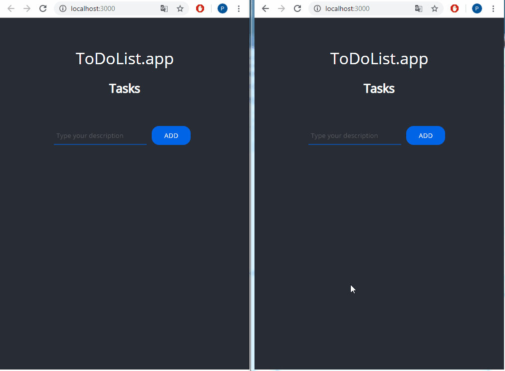

<p align="center">
<a href="https://to-do-websocket-app.herokuapp.com/"></a>
</p>


# <p align="center">✅ ToDoList.app (WebSocket)</p>
<p align="center">Project for mastering WebSocket</p>

</br>

## Table of Contents

- [What's this project about?](#about)
- [Technologies used](#tech)
- [What I learned?](#what)
- [Interesting code snippet](#interesting)
- [Installation and quick start](#install)
- [Website (on Heroku)](#site)

</br>

## <a name="about"></a>What's this project about?

This is a React to-do list application. I hope that no other panda has died through the next to-do list app 😁 The application is based on WebSocket communication. Allows to add and remove tasks in real time.

</br>

## <a name="tech"></a>Technologies used
- HTML
- CSS
- JavaScript
- React
- GIT
- Socket.io (WebSocket)
- Express

</br>

## <a name="what"></a>What I learned?

- work with more than one server (webpack-dev-server and express server) in the context of WebSocks,
- use the more advanced features of Socket.io,
- work with more complex data,
- use the [uuid](https://www.npmjs.com/package/uuid)package to add universally unique identifiers to the collection elements,
- use references to constant `io` in various files (Socket.io).


</br>

## <a name="interesting"></a>Interesting code snippet (for me of course 😉)
- client-side socket setup::

```js
import io from 'socket.io-client';

...
...

  componentDidMount() {
    this.socket = io((process.env.NODE_ENV === 'production') ? '' : 'http://localhost:8000');
    this.socket.on('updateData', (tasks) => this.setState({ tasks }));
    this.socket.on('addTask', (task) => this.addTask(task));
    this.socket.on('removeTask', (taskId) => this.removeTask(taskId));
  }

  removeTask(taskId, e) {
    const { state } = this;

    this.setState({ tasks: state.tasks.filter(task => task.id !== taskId) });

    // emit removeTask request if removeTask comes from us
    if (e) { this.socket.emit('removeTask', taskId) };
  }

  addTask(task) {
    const { state } = this;

    this.setState({ tasks: [...state.tasks, task,] });
  }

  submitForm(e) {
    const { state } = this;

    e.preventDefault();
    const task = { name: state.taskName, id: uuidv4() }
    this.addTask(task);
    this.setState({ taskName: '' });
    this.socket.emit('addTask', task);
  }


```


</br>

## <a name="install"></a>Installation

- use the package manager [npm](https://www.npmjs.com/get-npm) or [yarn](https://classic.yarnpkg.com/en/) to install dependencies:

```bash
npm install // yarn install

or

npm i // yarn
```
- run server with nodemon (after nodemon installation):

```bash
npm start

or

yarn start
```
- run watch mode to constantly refreshing react client:

```bash
cd client/

then:

npm start

or

yarn start
```

<br/>


## <a name="site"></a>Website (on Heroku)
[ToDoList.app](https://to-do-websocket-app.herokuapp.com/)
- if the page loads slowly, wait a moment, the server is waking up because it is hosted on a free platform Heroku.

</br>
</br>

  *project implemented as part of the 9-month [Web Developer Plus](https://kodilla.com/pl/bootcamp/webdeveloper/?type=wdp&editionId=309) course organized by [Kodilla](https://drive.google.com/file/d/1AZGDMtjhsHbrtXhRSIlRKKc3RCxQk6YY/view?usp=sharing)


